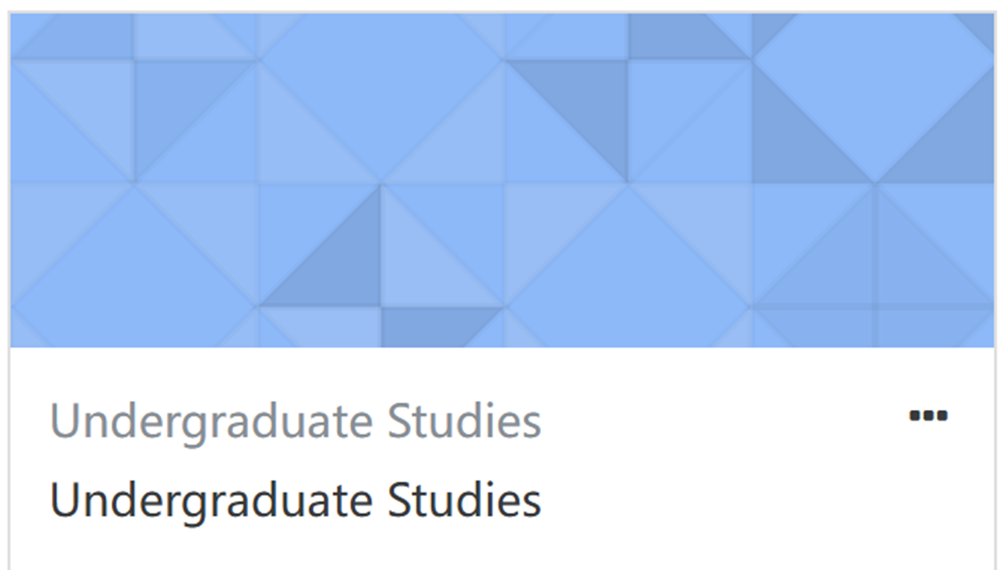
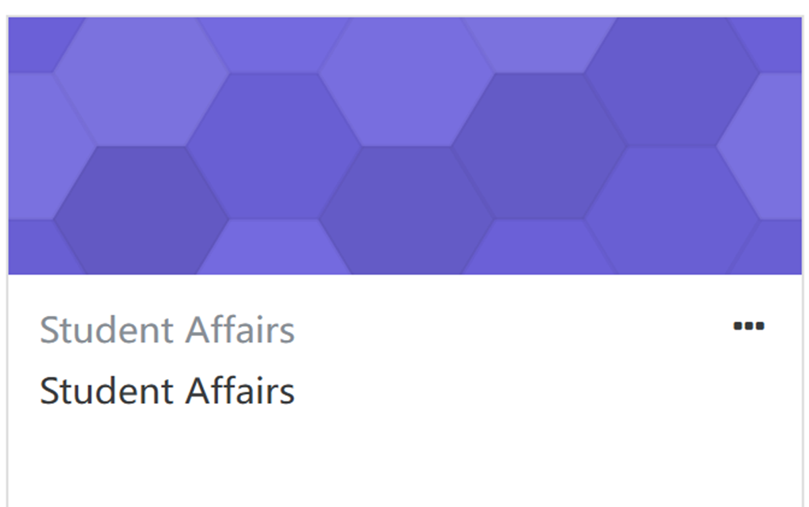

# § 学术规则介绍

## 1. Moodle资源介绍

### (1.1) Moodle-Undergraduate Studies

- **教学与课程**：制定考试规定、学术纪律条例、排课、选课、重修、学分转换、交换生项目、考试安排、成绩管理、成绩申诉
- **学籍方面**：指定学籍管理规定，提供各类官方证明材料，如在校生证明、排名信息、课程清单、课程大纲、英文授课证明、评分体系说明等，并为相关材料盖章、休学、停学、复学、校内转专业、转学至其他大学以及退学
- **学术管理**：监督学生GPA和课程通过率，识别并帮助(处理)学业不达标的学生
- **奖学金**
- **考勤管理**：强制执行(特别是对新生和GPA低于65分的学生)的课堂考勤政策，处理请假申请，并对缺勤率过高的学生采取相应措施。制定并发布学年校历

### (1.2) 2025 Preparatory Period

Requirements on Preparatory Courses towards Winter Semester

- All students in the **advanced English course with a grade &lt;70** and the students of the intermediate English group need to take 324032-TECHNICAL ENGLISH-ADVANCED A (0 credit).
- **MCS students who failed in Math (&lt;65) will have extended preparatory** and register for the courses following the enrollment rules of MCS.
- **Class attendance is compulsory** for all students during the Preparatory Period.

### (1.3.) Moodle-Student Affairs

- **住宿管理 :** 宿舍检查、退宿...管理访客入校申请，并负责学生校外居住的安全管理。
- **行为规范 :** 制定并执行《学生行为规范》、北校区学生中心管理规定等。
- **团学,社团,其他学生活动 :** 负责共青团事务（团员管理及团支部建设）。指导和管理学生社团及各类学生组织，包括社团的建立、注册、管理和活动开展。管理乐器练习房等学生活动设施，支持学生活动。
- **健康,医疗,安全 :** 提供全面的身心健康支持，包括心理健康教育、咨询服务及危机干预。负责学生的医疗保险（医保）事宜。开展性侵犯防治与应对等安全教育工作。
- **奖助学金 :** 负责组织评定和发放国家奖学金、助学金以及课外活动奖项，校内勤工助学项目，处理学生助理岗位申请。注意此处奖助学金是指其他非UG负责的奖学金，也就是说除了学业优秀奖学金以及续得奖学金，其他都有SA负责
- **实习就业 :** 提供Co-op实习岗位信息，组织实习宣讲会。提供职业发展服务，处理毕业生就业推荐表、就业违约等相关手续。
- **毕业手续 :** 负责协调和办理毕业生离校的各项手续。

### (1.4) Moodle-Career Services

- **一对一生涯咨询**：提供个人生涯规划、学业发展和职业探索方面的咨询服务。
- **申请文书修改**：提供专业的文书修改服务，包括个人简历（CV）、个人陈述（PS）等，并有明确的提交规范和修改周期建议。
- **资源提供**：建立了一个全面的“申研资源库”，提供从前期准备到最终申请的各类工具和资料，包括：

  - **求职技能培训**：提供实习申请攻略，指导学生如何准备中英文简历、应对网申笔试和准备面试（如STAR面试法）。
  - **行业认知拓展**：提供“职业树”（分专业职业路径图）、行业白皮书等资源，帮助学生了解不同行业的动态和发展路径。
  - **开设专属课程**：提供“Design Your Career”课程，通过系统化的学习，帮助学生探索自我，规划未来。
  - **专题工作坊**：举办线下文书写作课等多种主题的工作坊，提升学生的专项技能。
  - **申研资源库内容**
  
  

## 2. 预备学期课程概要

- **数学课**

  - lecture **概念**为主
  - tutorial **习题**为主，通过习题帮助理解lecture中所讲的概念
- **英语课**

  - intermediate
  - advanced A

  以上两门课程成绩**不计入GPA**

  - advanced B **计入GPA**
- $GPA = \frac{\Sigma(课程成绩 \times 课程学分)}{\Sigma 课程学分}$

### (2.1) 数学课要点

一切的复习都是基于笔记

-   **手写笔记软件 :** Notability, Goodnotes, OneNote, Noteful etc.

-   **电子笔记软件 :** LaTeX, Obsidian, Notion, 思源笔记, Markdown etc.

### (2.2) Office hour!!!

任何学术内容都可以通过office hour与老师讨论

### (2.3) 英语课要点

|Semester Grade:||
| :--------------------------------------------------------------------------------------:| :---:|
|Midterm Quiz|15%|
|Vocabulary Quizze|10%|
|Final Examination|20%|
|projects (1st -10%, 2nd – 25%)|35%|
|Class task (the five question game)|5%|
|Listening|5%|
|Homework/classwork/active participation (graded) (main idea, summary, opinion writing)|10%|

这是分数的重点构成，除了与你的project本身有关，也与你的课堂活跃度有关

课堂目的：锻炼口语，适应英文环境，记住专有名词

### (2.4) 面对考试

- **数学**

  1. 重点关注老师给出的list中的定理以及在证明或留的Exercise，从而确定考试范围
  2. 提前进行复习，从而避免遗忘当周所学内容，比如每个周末都进行回顾
  3. 考试中有任何不清晰的问题问教授！！！大学考试自由度高于高中
- **英语**

  1. 认真复习老师课上讲过的语法点，英语考试不会超出教授提到的的范围
  2. 尽量作答所有题目！！！英语答案很多时候并不唯一
  3. 自己带字典！自己带字典！文章中一定会出很多生词，公共字典数量有限！不要因为借字耽误时间

### (2.5) 结果

- 通过预备学期  ➡️ 正常进入正式学期
- 没通过 ➡️ 进入extend (**不计入GPA**)，**不能选微积分1和代数A或更多课程无法选择**
- 注：高分通过和低分通过**几乎没有区别，重点是通过！！！**

## 3. 学业状态不达标的学生

若出现下列情况之一，则该学生的学业表现被视为“**不达标**”:

- GPA < 65分
- 课程通过(Pass)率低于66%
- 该生前一学期的学业成绩为“不达标”，且未能成功通过UG的指定课程
- 截至第四学期为止，英语水平(英语课)仍未达标
- 六年内仍未学习完本课内容
- 入学后前两个学期内，课程所获得的总学分低于27分 (不包括第一年需要修读强制性学习计划的学生)
- 连续三个compulsory学期会被斩杀

>   [!important]
>
>   以色列理工学院要求6年完成学业，若六年内未能完成学业则无法获得以色列理工学院学位证。
>
>   可能的结果: 转专业, 延期毕业, 转学, 退学...

## 4. A/B考

正式学期有两次考试机会: A考(无需报名)和B考(需报名, 教授会提醒, 在moodle届时会有报名链接), 对于参考安排, 有如下可能性

1. **参加A考但不参加B考 :** 不论是否报名B考, 只要不参加B考, 最终成绩取A考
2. **不参加A考但参加B考 :** 最终成绩取B考且需报名B考(如果忘记了可以联系UG和教授一般来说问题不大)
3. **参加A考且参加B考 :**  最终成绩取B考, 即使B考成绩低于A考, 因此谨慎参加B考
4. **不参加A考且不参加B考 :** 最终课程状态记录为incomplete(未完成), 不算入GPA, 也不是0分近似相当于没有上过这门课

## 5. 有关重修的问题

1. The **FINAL grade** (and not the highest grade) always counts. The grade of the retake course(s) is taken into account for GPA in the semester that it is actually taken.
2. If you FAILED the course(s) (with the grade lower than 55) in the past semesters, you **MUST** retake the course(s) if it is given (excluding GE/PE courses).
3. If you would like to retake the program course(s) in which you PASSED, you are entitled to enroll to improve a grade as long as NOT more than 1 year has passed since the original grade was given. You can self-enroll into the retaking courses if within credit limits. If you need additional credits for the retaking courses, you need to fill in the request form for additional credits and submit to UG Office, which will be forwarded to the advisor/head of the department/study program for their approval. With approval you are allowed to take the course(s).
4. There are good chances that you will encounter scheduling problems. Therefore, after you enroll in the course, please consult with the course instructor about how the grades are to be calculated (class attendance, homework submission and midterm, etc.).

## 6. 奖学金

### (6.1) 2025高考奖学金以及续得

规则仍在更改，请务必以最终版本为准！！！

自行去官网查询：[链接](https://sites.gtiit.edu.cn/admissions/2025freshmen-scholarship/)

注意:获得进阶激励奖学金的要求是入学已获得过奖学金  
如果没有请看后面的学业优秀奖学金

最终解释权归校方所有！！！！！

### (6.2) 2025学术卓越奖学金

|Type|Amount (RMB)|Awarding requirement|
| :------------------------------:| :------------:| :-------------------------------------------------------:|
|Vice Chancellor's List|105,000 Yuan|GPA >=90 and ranked top 5% in department/study program|
|Dean's List|75,000 Yuan|GPA >=85 and ranked top 10% in department/study program|
|Department/Program Head's List|50,000 Yuan|GPA >=85 and ranked top 15% in department/study program|

Student shall study at least 34 credits in the previous academic year.

---

在广东以色列理工学院入学时获得高考奖学金的学生，若每学年荣获学术卓越奖，将有资格获得额外奖金 (extra 10,000 RMB for and extra 5000 RMB for DH/PH's List)

官网链接：[Here](https://sites.gtiit.edu.cn/ug/item573.html)

