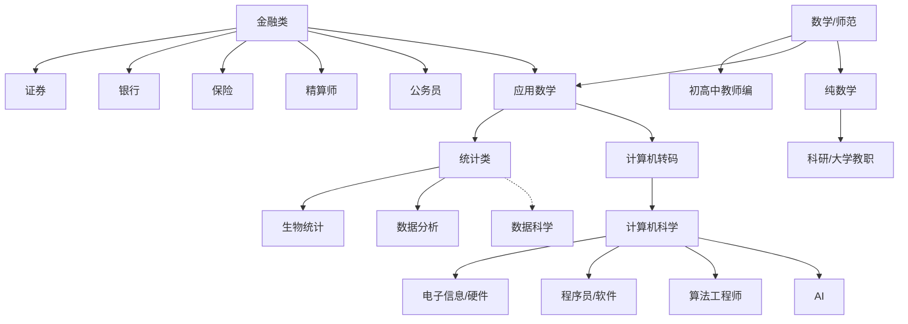
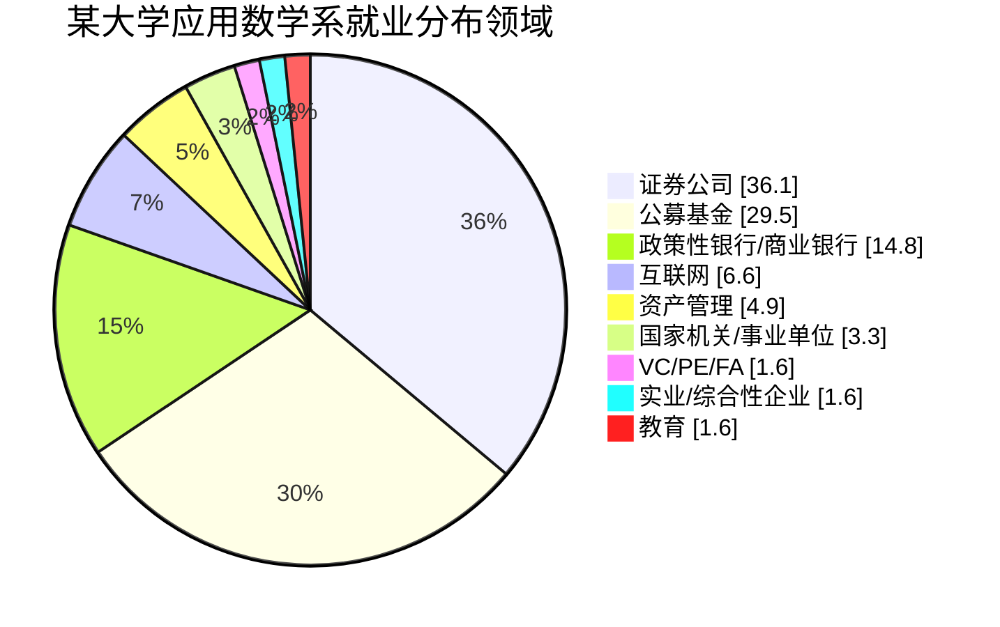

# § 申研与职业发展

## 0. Career讲座

-   [2025 数学系校友专场](./career-lectures/2025-mcs-schoolfellow.html)
-   [2025届申研经验分享会](./career-lectures/2025-5-7-apply.html)
-   [2025.6.7 升研升博指导会](./career-lectures/2025-6-7-apply.html)
-   [2025数学系升学去向](./career-lectures/2025-mcs-outcome.html)
-   [2025.3.6 雅思讲座会议笔记](./career-lectures/2025-3-6-IELTS.html)

## 1. 几大排名侧重点

|   排名   | 特点                                                         |
| :------: | :----------------------------------------------------------- |
|    QS    | QS世界大学排名的主观性指标所占比重大，学术水平和雇主评价是关键指标，更适宜关注学成后就业能力的同学。 |
|   THE    | THE作为一个较全面的排名，评分标准更细致，既关注大学科研实力，也关注学校声誉，还针对于机构收入等指标有所涉及。 |
| U.S.News | U.S.News关注科研，学术影响力权重巨大。学术辐射力的权重，也是四个排名中最大的。 |
|   ARWU   | ARWU关注科研，学术影响力权重巨大，不过ARWU全部采用客观性指标，同时针对于文献数量更为关心，对文献质量关注较少。 |

>   [!tip]
>
>   没有一个排名是完美的，QS饱受争议、US news不了解美国以外学校、上海软科受众太窄。
>
>   一般要结合多个排名具体分析，不同地区看不同排名，英联邦看QS、美国看US news美国国内大学排名。


## 2. 城市 & 就业

1. **英联邦国家**一般回国工作较多， 特别是香港、新加坡高校，在广州、深圳认可度较高。
2. **美国高校**的优点 就是有可能留美工作，毕竟花了那么多钱，不尝试一下就亏了。
3. 对于**计算机专业**来说，想找实习 & 工作就必须到大城市，比如：洛杉矶、西雅图、 纽约、波士顿。
4. 如果想要**读博**的，硕士所在城市就没那么重要。相比于找实习，在校期间多做一些科研更重要。


## 3. 数学系就业方向与课程选择





 

## 3. 计算机申研选校+专业

不同国家的项目设置

1. **英国，香港，新加坡**，大多都是一年制硕士，在一年制的基础上分出授课型和研究型。

    -   **优点 :** QS排名高，回国认可度高。一年制节省时间和开销。  

    -   **缺点 :** 留在当地工作的可能性很小。

2. **美国，加拿大**，大多数是两年制，不分研究型和授课型。

    不过少部分是一年制的professional项目，偏向找工作。

    -   **优点 :** 美国就业岗位多，留在当地工作可能性较大。  

    -   **缺点 :** 美国开销大，申请难度高，很多好学校在QS200以外，回国认可相对低。


### (1) CS强校及分布

参考网站: [csranking](https://csrankings.org/)

-   将过去10年各个大学的老师在CS四大领域顶会上发表论文的数量和影响力汇总，

    其基准非常客观且透明(QS、US news有很多主观因素)，为目前cs领域接受度最高的排名。

-   大多数同学学CS选择: 北美、新加坡、香港、英国、澳大利亚备选。


### (2) 为什么大多数同学选择美国

-   **科研角度 :** csranking Top200中，美国学校81，中国学校内地25 + 香港6，欧洲57

    | 世界                                          | 美国                                         | 中国大陆                      |
    | :-------------------------------------------- | :------------------------------------------- | :---------------------------- |
    | 194 ► University of Georgia 🇺🇸 📊              | 77 ► University of Arizona 🇺🇸 📊              | 21 ► Xiamen University 🇨🇳 📊   |
    | 194 ► University of Sheffield 🇬🇧 📊            | 77 ► University of Georgia 🇺🇸 📊              | 23 ► Hunan University 🇨🇳 📊    |
    | 194 ► University of Surrey 🇬🇧 📊               | 77 ► Washington State University 🇺🇸 📊        | 24 ► Shandong University 🇨🇳 📊 |
    | 194 ► Washington State University 🇺🇸 📊        | 82 ► California Institute of Technology 🇺🇸 📊 | 24 ► Xidian University 🇨🇳 📊   |
    | 194 ► Xidian University 🇨🇳 📊                  | 欧洲                                         | 26 ► NWPU 🇨🇳 📊                |
    | 210 ► California Institute of Technology 🇺🇸 📊 | 53 ► Hasso Plattner Institute 🇩🇪 📊           |                               |
    | 210 ► Cardiff University 🇬🇧 📊                 | 53 ► University of Freiburg 🇩🇪 📊             |                               |
    |                                               | 53 ► University of Sheffield 🇬🇧 📊            |                               |
    |                                               | 53 ► University of Surrey 🇬🇧 📊               |                               |
    |                                               | 58 ► Cardiff University 🇬🇧 📊                 |                               |

-   **找工作角度 :** 世界500强中与计算机相关的企业 :

    https://finance.sina.com.cn/tech/roll/2024-08-06/doc-inchsfmn0304481.shtml

    ```mermaid
    pie showData
        title 世界500强ICT领域各国企业占比
        "墨西哥" : 2
        "英国" : 2
        "西班牙" : 2
        "韩国" : 5
        "法国" : 5
        "德国" : 4
        "日本" : 7
        "中国" : 34
        "美国" : 39


### (3) CS申研国家地区选择

从科研和找工作两个方面分析，导致大多数同学出国学 CS 只选择美国、香港新加坡。

最终导致美国 CS 申请难度成为美国独一档，也成为了其他专业同学拿到的 offer 都赫赫有名，

但是数学系同学拿到 offer 不是很有名的原因。

**申研难度 :** 

-   美国 > 英国、香港、新加坡 > 澳大利亚

-   计算机 CS > STEM 其他理工科、商科 > 文科、管理学等


### (4) 美国学校CS大概排名

`f(学校名次, CS名次, 地理位置) = 学校申请难度`

| Tier | Universities                                                 |
| :--: | ------------------------------------------------------------ |
|  0   | **CS四大强校 :** MIT、斯坦福、卡内基梅隆、加州伯克利         |
|  1   | **学校非常出名 :** 普林斯顿、耶鲁等<br />**CS非常出名 :** 康奈尔、UIUC、佐治亚理工、华盛顿西雅图、密歇根安娜堡等 |
|  2   | **学校比较出名 :** 布朗、芝大、西北等<br />**CS比较出名 :** 加州圣地亚哥、威斯康辛、德州奥斯汀等 |
|  3   | **学校很好型 :** 约翰霍普金斯等<br />**学校名气大型 :** 纽约大学等<br />**学校、CS、地理位置都不错型 :** 南加州等 |
|  4   | Top30里CS一般的和Top50里CS比较好的                           |
|  5   | Top50里CS一般的Top100里CS比较好+地理位置好的                 |
|  6   | Top100里CS比较好的                                           |
|  7   | Top100里其他的和Top200 R1地理位置好或CS好的                  |


### (5) 美国常见硕士项目

`g(学位/学制, 专业) = 项目申请难度`

**学位 :**

-   **MS**: Master of Science (with/without Thesis Track) (一年半-两年) 

**科学硕士 (选/不选论文) :**

-   **MEng**: Master of Engineering (一年-两年) (工程硕士) 

-   **Professional Master** (一年) (职业硕士)

**难度 :**

-   MS with thesis > MS no thesis > MEng > Professional Master 

-   科学硕士 (可选论文) > 科学硕士 (不可选论文) > 工程硕士 > 职业硕士

**专业 :**

-   Computer Science (CS) (计算机科学)

-   Electrical Computer Engineering (ECE/CE) (电气工程、计算机工程)

-   Data Science (DS) (数据科学)

-   Information Science/Information Management (IS/IM) (信息科学)

-   Biostatistics/Bioinformatics (生物信息学)

**交叉学科 :**

-   Health Data Science、Data Science and Public Policy等

**学位与专业的排列组合 = 项目 :**

-   MSCS, MSIM, MCS (Master of Computer Science)

**项目难度 :**

-   CS > ECE、DS > IS、Biostatistics、交叉学科

-   MS with thesis > MS no thesis > MEng > Professional Master


### (6) 硕士难度总结

**研究生难度 :** 

-   美国 > 英国、香港、新加坡 > 澳大利亚

-   硬核理工科硕士 > 理工科、商科硕士 > 文科、社科、管理学硕士

好学校还是好项目一般只能二选一

即便有些美国前10的差项目难度也比美国前30的好项目低很多

**只说录取学校，不谈具体项目的都是“耍流氓”**


### (7) 美国博士

**和硕士的最大区别 :** 一个你给学校钱、一个学校给你钱

-   90%美国博士都是全奖录取：免学费 + 医疗保险 + 生活费（5年）

-   因此导致美国博士申请非常难，直博不只是在和国内优秀的本科生竞争，

    更多的是在国内外优秀的研究生竞争。

**博士要求 :**

-   GPA过线 + 科研经验/论文 + 2封以上强推荐信

-   connection（导师间互相推荐）> 推荐信 > 科研经验 > GPA成绩 > 语言、GRE等


## (8) Extra Resources

