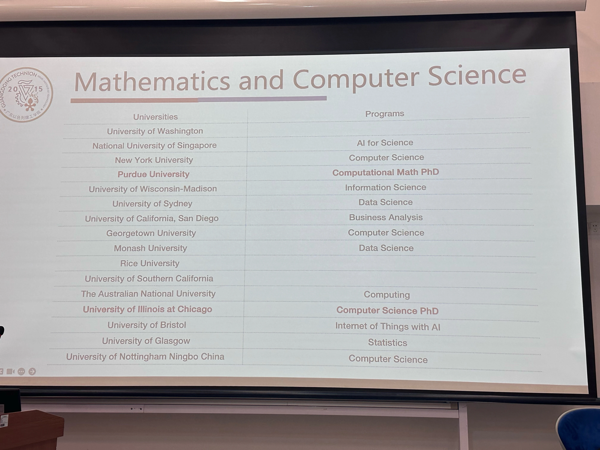

# 2025数学系升学去向

|大学名称 (英文)|大学名称 (中文)|QS 世界大学排名 (2025)|
| --------------------------------------------| ------------------------| ------------------------|
|University of Washington|华盛顿大学|**76**|
|National University of Singapore (NUS)|新加坡国立大学|**8**|
|New York University (NYU)|纽约大学|**43**|
|Purdue University|普渡大学|**89**|
|University of Wisconsin–Madison|威斯康星大学麦迪逊分校|**116**|
|University of Sydney|悉尼大学|**18**|
|University of California, San Diego (UCSD)|加州大学圣迭戈分校|**72**|
|Georgetown University|乔治城大学|**301**|
|Monash University|莫纳什大学|**37**|
|Rice University|莱斯大学|**141**|
|University of Southern California (USC)|南加州大学|**125**|
|The Australian National University (ANU)|澳大利亚国立大学|**30**|
|University of Illinois at Chicago (UIC)|伊利诺伊大学芝加哥分校|**365**|
|University of Bristol|布里斯托大学|**54**|
|University of Glasgow|格拉斯哥大学|**78**|
|University of Nottingham Ningbo China|宁波诺丁汉大学|90~|

​
